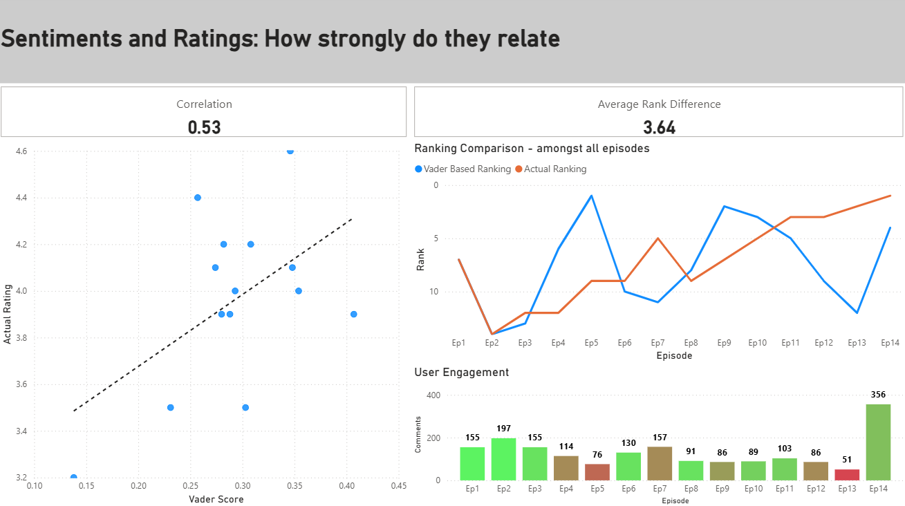

# Anime Sentiment Analysis (Blue Lock Season 2)

## Overview
This project analyzes user comments from **MyAnimeList** to explore how viewer sentiment and emotion correlate with anime episode ratings.  
By leveraging **natural language processing (NLP)** and **data visualization**, I aimed to determine whether audience sentiment could serve as a strong predictor of episode ratings.

---

## Tech Stack
- **Python**
  - Web scraping with `BeautifulSoup`
  - Sentiment analysis using **VADER** and **DistilBERT (English model)**
  - Data wrangling and cleaning with `pandas`
  - Text analytics with **TF-IDF**
  - Visualization using `matplotlib` and `seaborn`
- **Databricks SQL**
  - Aggregations and CTEs for advanced analytics
  - Window functions for ranking and averaging metrics
- **Power BI**
  - Interactive dashboards for visual insights and trend analysis

---

## Methodology

### 1. Data Collection
- Scraped **MyAnimeList** for anime ratings and user comments using `BeautifulSoup`.
- Ensured **data integrity** by removing duplicates and handling missing values.

### 2. Sentiment & Emotion Analysis
- Applied **VADER** for general sentiment polarity (positive, neutral, negative).
- Used **DistilBERT** to detect emotion-specific intensities (joy, sadness, disgust, surprise, etc.).
- Generated a **correlation heatmap** to visualize relationships between sentiment, emotions, and episode ratings.

### 3. Text Analysis
- Extracted **top indicative words** for each emotion using **TF-IDF**, highlighting linguistic patterns across user reactions.

### 4. SQL Analytics (Databricks)
- Created a refined table retaining only the most relevant metrics.
- Used **window functions** and **CTEs** to calculate averages, rankings, and grouped statistics.
- Categorized comments based on **VADER sentiment** for nuanced comparison (positive, neutral, negative).

---

## Key Findings (Power BI)

| Insight | Description |
|----------|-------------|
| **Correlation between VADER score and episode rating:** | `0.53` — moderate positive relationship |
| **Average rank discrepancy:** | `3.64` — average difference between predicted (VADER) and actual episode ranking |
| **Impact of engagement:** | Episodes with **low comment counts** show high sentiment variability |
| **Emotion correlations:** | `Surprise (0.56)` and `Joy (0.38)` strongly associate with higher ratings |
| **Negative emotion indicators:** | `Disgust (-0.86)` and `Sadness (-0.61)` strongly correlate with lower ratings |
| **Interpretation:** | Viewers enjoy surprise elements regardless of positive or negative tone (e.g., cliffhangers). However, episodes that evoke **disgust or sadness** tend to receive significantly lower ratings. |

- Sample visualization

---
## Limitations
- The analysis in this project only pertains to the anime Blue Lock season 2
- Correlation measurements are created based on a small number of aggregated. The results should looked at more as exploratory, rather than definitive, findings
---

## Conclusion
- Sentiment alone is **not a reliable predictor** of anime episode ratings.
- **Emotional nuance** (especially surprise and disgust) provides much stronger predictive power.
- Viewer **engagement volume** heavily affects sentiment consistency — caution is needed when predicting ratings from small comment samples.

---

## Future Improvements
- Incorporate **transformer-based fine-tuning** for more accurate emotion detection.
- Analyze **temporal patterns** (e.g., how sentiment evolves across episodes).
- Integrate **topic modeling (LDA/BERT embeddings)** to discover thematic influences on viewer reactions.

---

## Feel free to connect or provide feedback on improvements!
Linkedin: https://www.linkedin.com/in/jack-liao-90aa7a1a8/

